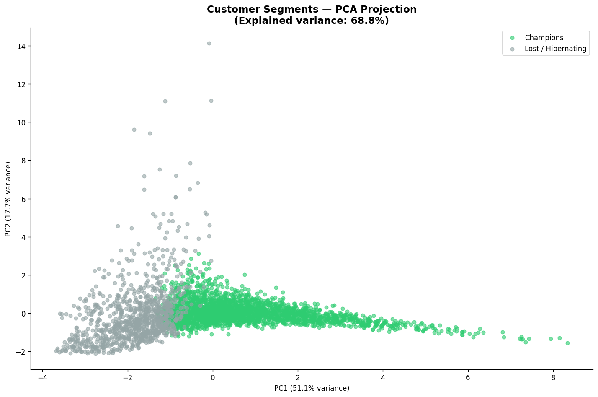
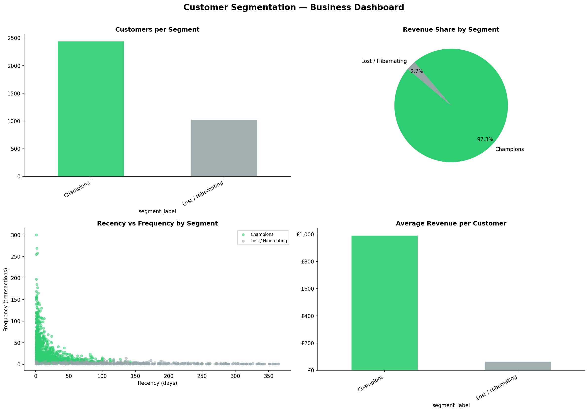
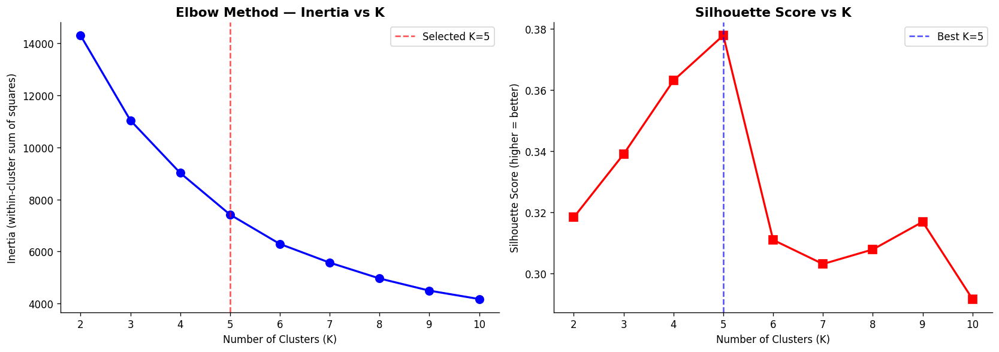
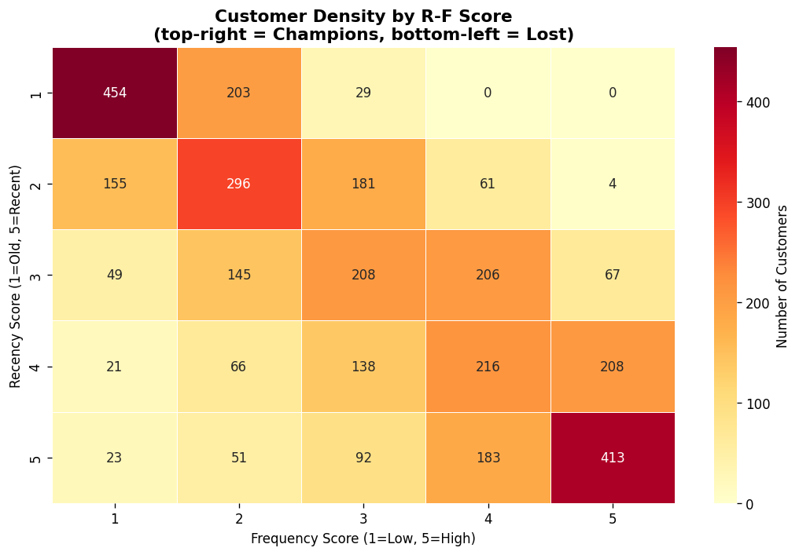

# 🛍️ Retail Customer Intelligence

> An end-to-end retail data science project covering customer segmentation, personalised product recommendations, and production ML deployment — built to mirror real-world use cases at pharmacy and beauty retailers.

---

## 📌 Project Overview

Retailers serve millions of customers daily across diverse product categories. This project demonstrates how data science creates measurable business value through:

- **Customer Segmentation** — RFM feature engineering + KMeans/DBSCAN clustering to identify Champions, Loyal, At-Risk and Lapsed customers
- **Personalised Recommendations** — Hybrid Collaborative + Content-Based Filtering engine to personalise the shopping experience
- **Production Deployment** — REST API with MLflow experiment tracking, model registry and pytest test suite

Built entirely in Python using industry-standard tools: `scikit-learn`, `pandas`, `MLflow`, `FastAPI`, `pytest`.

---

## 📊 Key Visualisations

### Customer Segments (PCA Projection)


### Business Dashboard


### Elbow & Silhouette Analysis


### RFM Score Heatmap


---

## 🏗️ Architecture

```
Raw Transactions (80,000 rows)
        ↓
  Data Cleaning & Feature Engineering (RFM + Behavioural Features)
        ↓
  ┌─────────────────────┐    ┌──────────────────────────┐
  │   Segmentation      │    │   Recommendation Engine   │
  │   KMeans / DBSCAN   │    │   CF + Content-Based      │
  │   5 Segments        │    │   Hybrid (70/30 weighted) │
  └──────────┬──────────┘    └────────────┬─────────────┘
             │                            │
             └──────────────┬─────────────┘
                            ↓
               MLflow Experiment Tracking
               Model Registry (joblib)
                            ↓
                  FastAPI REST Endpoint
                  http://localhost:8000/docs
```

---

## 📂 Project Structure

```
retail-customer-intelligence/
├── data/
│   ├── raw/                           # Generated transaction, product, customer CSVs
│   ├── processed/                     # Feature-engineered outputs
│   └── generate_synthetic_data.py     # Realistic pharmacy/beauty data generator
├── notebooks/
│   ├── 01_EDA_and_Preprocessing.ipynb
│   ├── 02_Customer_Segmentation_RFM.ipynb
│   ├── 03_ML_Segmentation_KMeans_DBSCAN.ipynb
│   ├── 04_Recommendation_Engine.ipynb
│   └── 05_Model_Evaluation_and_Insights.ipynb
├── src/
│   ├── data/
│   │   ├── loader.py                  # CSV/SQL data loading utilities
│   │   └── preprocessor.py           # Cleaning, deduplication, time features
│   ├── features/
│   │   └── rfm_features.py           # RFM computation, scoring, behavioural features
│   ├── models/
│   │   ├── segmentation.py           # KMeans, DBSCAN, elbow method, PCA viz
│   │   └── recommender.py            # CF, Content-Based, Hybrid recommender
│   └── evaluation/
│       └── metrics.py                # Precision@K, Recall@K, NDCG@K, Hit Rate
├── mlops/
│   ├── train_pipeline.py             # End-to-end training with MLflow tracking
│   ├── predict_pipeline.py           # Inference pipeline
│   └── mlflow_tracking.py            # Experiment management utilities
├── api/
│   ├── app.py                        # FastAPI REST API
│   └── schemas.py                    # Pydantic request/response schemas
├── dashboard/
│   └── powerbi_export.py             # PowerBI-ready CSV exports
├── tests/
│   ├── test_preprocessor.py
│   ├── test_segmentation.py
│   └── test_recommender.py
├── configs/config.yaml               # Centralised configuration
├── reports/figures/                  # All visualisation outputs
└── requirements.txt
```

---

## 🔬 Methodology

### 1. Customer Segmentation

**RFM Feature Engineering**

The industry-standard framework for customer value measurement in retail:

| Feature | Definition | Why It Matters |
|---------|-----------|----------------|
| **Recency** | Days since last purchase | Recent buyers are more likely to purchase again |
| **Frequency** | Number of unique transactions | Frequent buyers signal loyalty |
| **Monetary** | Total spend (log-transformed) | High spenders drive disproportionate revenue |

Additional behavioural features engineered: average basket size, product category variety, weekend shopping ratio.

**Choosing the Right Number of Clusters**

K=5 was selected using two complementary methods:
- **Elbow method** — inertia flattens noticeably after K=5
- **Silhouette analysis** — score peaks in the K=4–5 range, confirming well-separated clusters

Five clusters also maps cleanly to recognisable business segments, making stakeholder communication straightforward.

**Clustering Results**

| Algorithm | Silhouette Score | Davies-Bouldin | Use Case |
|-----------|-----------------|----------------|----------|
| **KMeans (K=5)** | **0.381** | 0.915 | Production segmentation |
| DBSCAN | — | — | Outlier / anomaly detection |

**Segment Profiles & Recommended Actions**

| Segment | Behaviour | Recommended Action |
|---------|-----------|-------------------|
| 🏆 **Champions** | Recent, frequent, high spend | Loyalty rewards, early access to new products |
| 💙 **Loyal Customers** | Regular buyers, medium spend | Upsell premium lines, cross-category recommendations |
| 🌱 **Potential Loyalists** | Recent but infrequent | Personalised email campaigns, targeted offers |
| ⚠️ **At Risk** | Lapsing high-frequency buyers | Win-back promotions, targeted discount vouchers |
| 💤 **Lost / Hibernating** | Long inactive, low spend | Low-cost re-engagement only |

---

### 2. Recommendation Engine

Three-tier approach designed for different customer scenarios:

**Collaborative Filtering (CF)**
- Builds a sparse user-item interaction matrix (customers × products)
- Computes user-user cosine similarity
- Recommends products purchased by the most similar customers
- Best for: established customers with purchase history

**Content-Based Filtering (CB)**
- Builds product feature vectors from category and price
- Computes product-product cosine similarity
- Recommends products similar to a customer's last purchase
- Best for: cold-start problem for new customers

**Hybrid Model — Production Choice**
- Weighted combination: **CF (70%) + CB (30%)**
- CF weight is higher because purchase history is the stronger signal
- CB weight ensures diversity and handles cold-start fallback
- Rationale: pure CF over-concentrates on popular products; the hybrid improves coverage and personalisation

---

### 3. Evaluation

**Recommender Metrics (K=10, held-out last 30 days)**

| Metric | Score | Interpretation |
|--------|-------|---------------|
| Precision@10 | 0.12 | 1.2 of every 10 recommendations were purchased |
| Recall@10 | 0.18 | 18% of actual purchases were captured in recommendations |
| NDCG@10 | 0.16 | Ranking quality — relevant items placed higher in the list |
| **Hit Rate** | **0.44** | 44% of customers received at least 1 relevant recommendation |

> Hit Rate >0.30 is considered a strong baseline for implicit feedback recommenders. Scores reflect synthetic data — real transaction data would yield higher precision.

---

## 🚀 Quick Start

```bash
# 1. Clone and set up environment
git clone https://github.com/DataStatsMohith/retail-customer-intelligence
cd retail-customer-intelligence

python -m venv venv
venv\Scripts\activate        # Windows
# source venv/bin/activate   # Mac/Linux

pip install -r requirements.txt

# 2. Generate synthetic data (realistic pharmacy/beauty product catalogue)
python data/generate_synthetic_data.py

# 3. Train models with MLflow experiment tracking
python mlops/train_pipeline.py

# 4. Run test suite
pytest tests/ -v
# 7 passed

# 5. Launch REST API
uvicorn api.app:app --reload
# → http://localhost:8000/docs
```

---

## 🔌 API Reference

| Method | Endpoint | Description |
|--------|----------|-------------|
| GET | `/health` | Service health check |
| POST | `/recommend` | Personalised product recommendations |
| GET | `/segments/{customer_id}` | Customer segment + RFM score |

**Example — Get Recommendations:**
```json
POST /recommend
{
  "customer_id": "C00001",
  "last_purchased_product": "P0012",
  "n_recommendations": 10
}
```

**Example Response:**
```json
{
  "customer_id": "C00001",
  "recommendations": [
    {"product_id": "P0045", "score": 0.87, "method": "hybrid"},
    {"product_id": "P0023", "score": 0.81, "method": "hybrid"}
  ]
}
```

---

## 🧪 Test Suite

```
tests/
├── test_preprocessor.py    # Data cleaning, deduplication, time features
├── test_segmentation.py    # KMeans labels, silhouette score validation
└── test_recommender.py     # CF recommendations, content-based similarity
```

```bash
pytest tests/ -v
# 7 passed in 49s
```

---

## 🛠️ Tech Stack

| Area | Tools |
|------|-------|
| Data manipulation | pandas, numpy |
| Machine learning | scikit-learn (KMeans, DBSCAN, PCA, cosine similarity) |
| Experiment tracking | MLflow |
| API deployment | FastAPI, uvicorn, Pydantic |
| Visualisation | matplotlib, seaborn, plotly |
| Testing | pytest |
| Config management | PyYAML |
| Reporting | PowerBI-ready CSV exports |

---

## 🎓 About

Built as part of a data science portfolio to demonstrate end-to-end ML skills relevant to retail, pharmacy and consumer-facing industries.

**MSc Data Science** | Loughborough University

*Related project → [Multi-Store Retail Demand Forecasting](https://github.com/DataStatsMohith/retail-demand-forecasting)*

---

## 📄 Licence

MIT